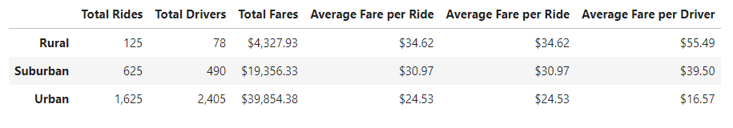

# Pyber_Analysis

## Overview
This is an in-depth analysis of data from thepopular ride-sharing app PyBer. In this analysis, we explore relations between data collected from over 2,000 rides in 2019. This data is categorized based on the type of city where the ride took place: Urban cities, Suburban cities, and Rural areas. 

### Purpose
The purpose of analyzing this data is to view the relationship between the type of city and fare prices, number of rides, and number of drivers. The findings will help PyBer determine ways to increase access and affordability for underserved areas. 

## Results

### Comparing Urban cities, Suburban cities, and Rural areas

Comparisons of the data show that Rural areas have the fewest number of rides and drivers, Urban cities have the highest number of rides and drivers, and Suburban areas fall somewhere between. Naturally, due to supply and demand, the cost of a ride in Rural areas is much higher than in Urban cities due to fewer available drivers. The average fare per driver is similarly higher in Rural areas. Despite the higher average fare per ride in Rural areas, Urban cities and Suburban cities more than make up for the lost revenue in volume of rides, with the total fare in Urban cities is almost ten times that of the total fare in Rural areas. This is visualized in the below figure:

## Summary
To help address the disparities between Urban cities, Suburban cities, and Rural areas, we would recommend:
- Increasing the number of drivers available in Rural areas, possibly my moving drivers from Urban cities. 
- Operating at a loss, or with a lower profit margin, in Rural areas in order to increase popularity of the PyBer app amongst residents of Rural areas, and gradually raising prices as popularity increases.
- Reducing the number of available drivers in Urban cities in order to justify raising the fare per ride. 